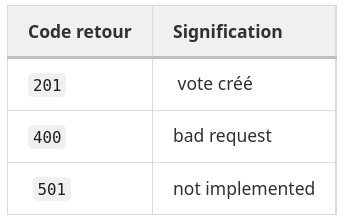
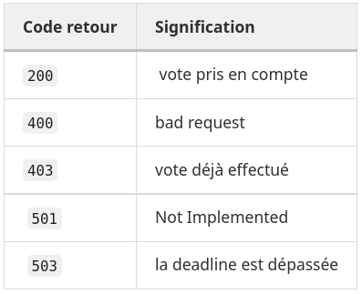
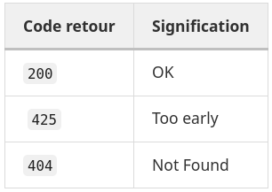

# Bureau de vote

UV : AI30 Systèmes Multi-Agents, 4ème année, Génie Informatique, UTC

Auteurs : Anne-Soline GUILBERT--LY & Eloïse MOREIRA

Date : Novembre 2022

Le but de ce TP est d'implémenter un service de vote grâce à un serveur REST. Cette procédure de vote utilise plusieurs méthodes de votes (Borda, Majorité Simple, STV, Copeland...).

## Comment récupérer le projet ?

Créez un nouveau dossier dans lequel sera le projet. 
Effectuez la commande suivante :
```shell
go mod init ia04
```
Puis effectuez la commande suivante :
```shell
go get gitlab.utc.fr/aguilber/ia04
```

## Implémentation choisie

Nous avons mis en place 3 endpoints : 
#### - /new_ballot 
qui crée un Scrutin, avec la méthode de vote, la deadline, la liste des votants, et le nombre d'alternatives.
Le serveur vérifie que la deadline n'est pas dépassée avant de l'ajouter à la liste de tous les scrutins. Il vérifie aussi que la méthode de vote existe, et que les voter-ids sont bien écrits.

#### - /vote
qui correspond au dépôt des préférences d'un votant. Il envoie les informations suivantes au serveur : l'agent-id, le vote-id (scrutin pour lequel il va voter), les préférences, et un tableau d'option qui représente le threshold pour la méthode de STV.

#### - /result
qui renvoie le résultat du vote. Le client envoie seulement le ballot-id.
Le serveur vérifie que le ballot-id existe bien, ainsi que la deadline : Si la deadline n'a pas encore été dépassée, le serveur ne fera pas le calcul du résultat car les votants ont encore le temps d'aller voter. Si elle est dépassée, le serveur calcule le résultat selon la méthode de vote donée précédemment. Les algorithmes des méthodes de vote (dossier comsoc) ont été réalisé précédemment lors de la première partie de ce TP.

Cependant, cette fonctionnalité sur la deadline n'a pas pu être testée. En effet, il faudrait laisser tourner l'API et pouvoir exécuter en temps-réel les commandes /vote pour ajouter des votants, et /result au bon moment, pour pouvoir recevoir un résultat. Etant contraintes par le temps, nous n'avions pas pu faire un IHM via le terminal qui aurait permis de tester cela.

Voici l'extrait concerné pour la deadline (serveur.go, ligne 350) :

```golang
today := time.Now()
deadlineTime, errParseTime := time.Parse(time.UnixDate, ballot.Deadline)
if errParseTime != nil {
	fmt.Println(errParseTime)
} else {
	if deadlineTime.After(today) {
		w.WriteHeader(http.StatusTooEarly)
		msg := fmt.Sprintf("The deadline %s is NOT YET exceeded.", ballot.Deadline)
    	log.Println(msg)
		w.Write([]byte(msg))
	} else {
			rule = ballot.Rule
		}
}
```

## Codes de retour
Voici les codes de retour renvoyés pour chaque endpoint :
#### - /new_ballot


#### - /vote


#### - /result

